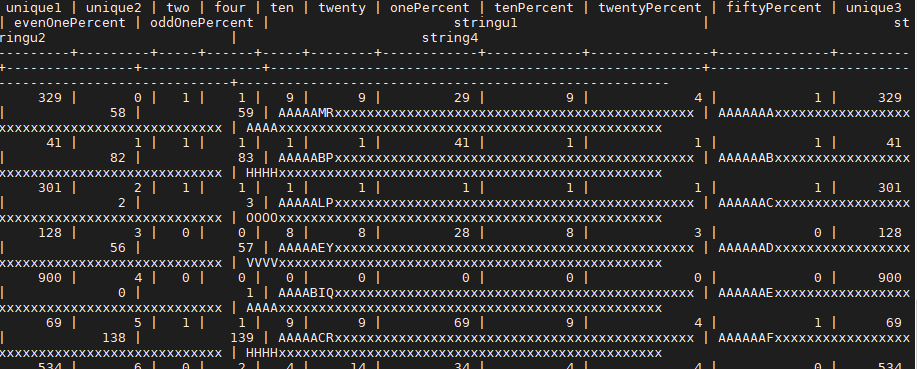

# DB-Implementation project part1
### 1. Brief description:
Main intention was to generate data based on Wisconsin benchmark specification. The data is generated using script written in python language. Once the data gets generated, we load that into PostgreSQL database using "COPY" command.

### 2. System working with and why chose it –
PostgreSQL database.  
Reason for choosing this Sytem is: We are familiar and have experience working with this system.  ALso it is quite easy to use. 

### 3. Demonstrate that data is loaded into system:
We used postgres copy command to load the data into the system. Loaded all the three relations - TENKTUP1, TENKTUP2, ONEKTUP into the postgres. 
Command used : \copy db.ONEKTUP FROM './ONEKTUP.csv' DELIMITER ',' CSV HEADER; 
Below is the snapshot for ONEKTUP relation.

Likewise did for other two relations.

### 4. Lessons learnt/ problems encountered:
Lessons learnt :  
<ul><li> How to create clustered and non clustered indexes on an attribute.</li>
<li /> Making the Benchmark scalable by manipulating the string attributes.
<li /> Understood the semantics and Statistics of relations.
<li /> Control of selectivity
</ul>
Problems Encountered :  
<ul> Faced issues while generating data for string atrributes. Python does not allows to get character at particular array index. Converted the string into list. ALso used str = dict(zip(range(1, 27), string.ascii_uppercase)) to replace numbers with letters.
</ul>
